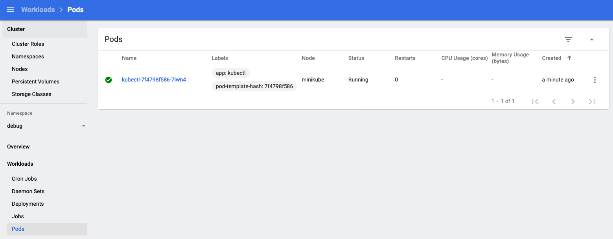
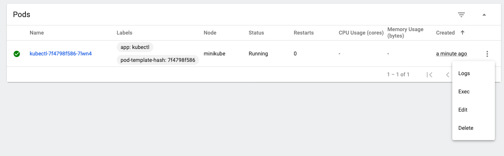
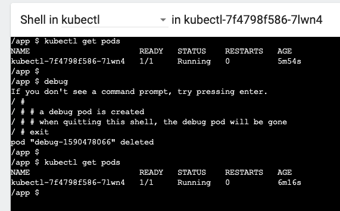

# Kubectl in a Pod

## Purpose

Providing a "debug" pod for k8s users who don't have access to CLI but only access to kubernetes dashboard.

## Dependency

Kubernetes dashboard

## How it Works

It creates a pod "kubectl":

- which is runing all the time
- using minimal resources
- health/readiness check on 8080/
- the pod has permission to create and attach to a pod in the debug namespace.

In k8s dashboard you can open a terminal to this "kubectl" pod, then in the shell:

- run command `debug`, which will run a pod with shell using `nicolaka/netshoot` image for debugging network issues
- when you `exit` the shell, the debug pod will be deleted automatically

## Deploy

`kubectl apply -f kubectl.yaml`

This deploys in debug namespace, with role, rolebinding.

## Image

`ironcore864/kubectl-debug-pod:1.17.3`

## Usage

